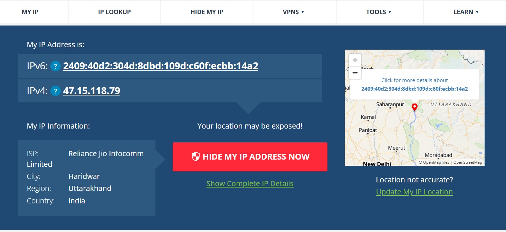
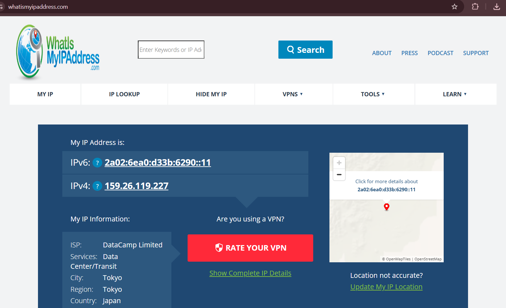

# VPN Privacy and Secure Communication Lab

## 🎯 Objective
The goal of this project is to understand the role of Virtual Private Networks (VPNs) in protecting online privacy and establishing secure communication. This lab covers setup, IP verification, and a comparison of browsing experiences with and without a VPN.

## 🛠️ Tools Used
*   **VPN Provider:**- Proton VPN
*   **Platform:** Browser Extension-Chrome
*   **Verification Tool:** [whatismyipaddress.com](https://whatismyipaddress.com)
*   **Speed Test:** [fast.com](https://fast.com)

---

## 🚀 Lab Steps & Results

### 1. Setup and Installation
- **Action:** Signed up for a free account and added the VPN via browser extension settings.
- **Benefit:** Using an extension provides a lightweight way to encrypt browser traffic without installing a full system-wide application.

### 2. Connection Status & IP Verification
I verified my connection by checking my public IP address before and after enabling the VPN.

| Status | IP Address | Location (City/Country) |
| :--- | :--- | :--- |
| **VPN Disconnected** | 47.15.118.79 | Haridwar |
| **VPN Connected** | 159.26.119.227 | Tokyo |

> **Screenshot Placeholder:** 
### 📸 Evidence: IP Address Change

**Before VPN:**

**After VPN:**

### 3. Traffic Encryption & Browsing
While connected, I browsed several websites. Because the VPN creates an **encrypted tunnel**, my Internet Service Provider (ISP) can no longer see the specific URLs or data I am accessing; they only see encrypted traffic travelling to the VPN server.

### 4. Speed & Performance Comparison

| Metric | Without VPN | With VPN |
| :--- | :--- | :--- |
| **Download Speed** | 49 Mbps | 80Mbps |
| **Observation** | Standard ISP speed. | Faster due to lack of ISP throttling |

---

## 📚 Research: VPN Deep Dive

### Encryption & Privacy Features
*   **AES-256 Encryption:** The standard "military-grade" encryption used to scramble data.
*   **No-Logs Policy:** Ensures the VPN provider does not store a history of your browsing habits.
*   **IP Masking:** Replaces your real-world location with the address of the VPN server.

### Benefits
1.  **Privacy:** Prevents ISPs and advertisers from tracking your activity.
2.  **Security:** Protects data when using "unsecured" public Wi-Fi (like at cafes).
3.  **Bypassing Throttling:** Can improve speeds if the ISP is intentionally slowing down specific traffic (like streaming).

### Limitations
1.  **Trust:** You are shifting your trust from your ISP to your VPN provider.
2.  **Latency:** Can sometimes increase "ping," which affects real-time gaming.
3.  **Partial Anonymity:** A VPN hides your IP, but it does not stop tracking via browser cookies or "fingerprinting."

---

## 🏁 Conclusion
This lab demonstrated that a VPN is a powerful tool for masking identity and securing data. While it can sometimes improve speeds by bypassing ISP throttling, its primary value lies in the encryption tunnel that keeps browsing activity private from external observers.
